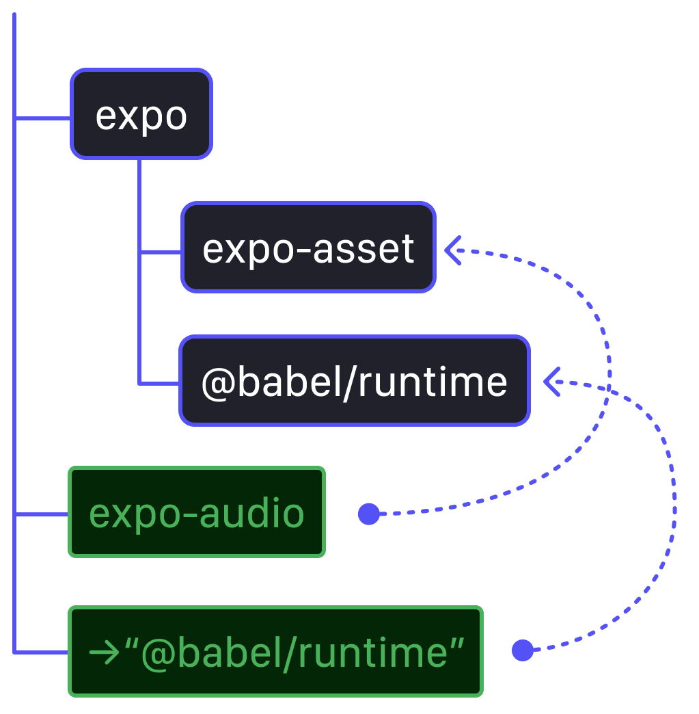

import { Note } from '~/components/Note/Note';

What happens when you install your Expo app's dependencies? Initially, this might seem like a
straightforward question, but Expo and React Native are at the intersection of native
and JavaScript development, and have to reconcile the expectations of both.
It's become a bit of a meme that upgrading Expo SDKs is a nightmare. Between native
build issues, versioning problems, and updated instructions, it's hard to differentiate
signal from noise.

Cutting through the noise and identifying the root causes usually reveals two repeating
mechanisms behind most failed upgrades: **Autolinking** and **dependency management**.

Autolinking is a process that promises to make dependency management in React Native easier,
allowing us to treat native modules as regular dependencies from npm. Autolinking
automatically links a dependency's native code into your build, which the dependency's
JavaScript code may then access and use.

However, maybe unsurprisingly, while autolinking did its best to bridge the valley
between native code and JavaScript, this is also where the conventions of native and
JavaScript development and build systems collide.

**How did autolinking break its promise?**

## Dependency trees grow roots too

All dependency management systems function upon a few common principles. A dependent
(a package or the root of a project) may specify dependencies that must be fulfilled
within a specified version constraint. These constraints subsequently are resolved
and packages are installed by your package managers. Every dependency may itself
declare dependencies, also known as transitive dependencies. This builds up a dependency
graph, a tree of packages that a package manager installs.

While there are many package management systems, they generally fall into two distinct categories
when it comes to resolving duplicate dependencies. This conflict resolution differs depending
on whether you're dealing with a **flat** or **nested** package manager.

Flat package managers treat version ranges as a validation constraint. When the same package is
installed with two incompatible version ranges, this conflict results in an error.
These package managers prevent installing a package's version `<2` when another dependency
requires version `>2`. This is a strategy that's employed when there are underlying restrictions that
only allow a package to be installed once.

However, with nested package managers, like npm, this is different.
[Node.js' module resolution](https://nodejs.org/api/esm.html#resolution-algorithm-specification)
allows for nested `node_modules` directories. Even if two version ranges for a package
conflict, two versions can be installed simultaneously. For example, if you depend on
`lodash@3.0.0`, but a dependency of yours depends on `lodash@4.0.0`, the conflicting version
is placed into a nested `node_modules` directory. This means that while all package managers
treat version ranges as constraints, nested package managers don't outright prevent duplicate
versions from being installed.


If we're only dealing with utility libraries, like `lodash`, this strategy is amazing and flawless.
Libraries can share code and dependencies, and, if a conflict occurs, our apps will continue to
build and run. However, apps don't only depend on utility libraries, exporting pure functions.

| Package Manager | Installation behaviour |
| -- | -- |
| Cocoapods | Disallows duplicate versions |
| Gradle | Disallows duplicate versions |
| npm | Nests duplicate version |

Most dependency issues you'll encounter in JavaScript projects actually occur because of nested
dependency installations. Runtime dependencies, or essentially any dependency that has side-effects,
may not expect multiple versions of itself to be installed, which is behaviour very similar to
native dependencies and why native package managers disallow duplicate versions of packages.

However, unlike in Cocoapods or Gradle, this isn't a hard constraint, and dependency conflicts
may not immediately become obvious.

### Your dependencies are my dependencies

Every JavaScript project typically has four different kinds of dependencies:
- Utility/pure libraries
- Runtime/side-effect libraries
- Tooling utilities and protocol libraries
- Tooling and scripts

Of these categories, only "pure" libraries are always safe to duplicate, since they exclusively
expose a public API, don't manipulate or store state in the runtime, and are side-effect free.
Tooling and dependencies that define or use protocols, are generally safe to duplicate, but not
safe to mix with incompatible versions.

Generally, from the perspective of most JavaScript apps, conflicts are easily avoided.
Runtime/side-effect libraries often are required to be installed only once as a top-level dependency.
And tools, like the `expo` package, are installed just once as a top-level dependency also.

You may have encountered the ["Invalid hook call" error](https://legacy.reactjs.org/warnings/invalid-hook-call-warning.html)
in React apps. The React runtime library is an API layer that's filled in by renderers, such as `react-dom`.

```
Uncaught Error: Invalid hook call. Hooks can only be called inside of the body of a function component. This could happen for one of the following reasons:
1. You might have mismatching versions of React and the renderer (such as React DOM)
2. You might be breaking the Rules of Hooks
3. You might have more than one copy of React in the same app
```

This happens because when two versions of `react` are bundled into your app, the `react-dom` renderer
only instantiates itself in one of them; the other remains in an uninitialised state. The `react`
package cannot be duplicated in this way. **What happens to transitive dependencies though?**

Any dependency can itself depend on libraries that cannot be duplicated as well. This means
there are "dangerous" dependencies, such libraries defining a `"dependencies"` entry for `react`.
If we need to depend on a package that may only be installed once, we instead need to define
them in `peerDependencies`,
<Note>Note that some package managers handle peer dependencies inconsistently</Note>
which instructs the package manager to share a single version that the app defines.

### Dependency chains in Expo

Expo has to resolve extremely wide-ranging dependency requirements, of which the easiest to
address are `react-native` and `react`, surprisingly.

React Native depends on React as an API package, naturally, and Expo apps depend on and are
React Native apps. These relationships are defined as `peerDependencies`. This means your
Expo project needs to install `expo`, `react`, and `react-native`; defining them as direct
dependencies. So far so good. These also being peer dependencies of other dependencies
in the ecosystem means they're installed once and we typically don't run into conflicts with them.
**But what about transitive dependencies?**

`react-native` both implicitly and (currently) explicitly depends on [Metro](https://metrobundler.dev/),
and Expo does the same. Metro is a dependency of Expo for bundling and exporting Expo apps.
We wrap around Metro, modify, and customise it; and React Native's versions have some assumptions
(implicit constraints) on the version of Metro and bundling process.

Several build-time tools in the React Native ecosystem rely on Metro, which is split into
several `metro-*` sub-packages. One complication and assumption of Metro that's important
is that all `metro` packages and `metro-*` packages have to have matching versions typically.
This cascades into an expectation that only a single version of Metro should participate in
bundling an Expo app.

This creates a tough problem. We can't take on `metro` as a peer dependency, since we don't
want people ideally to install it directly — It's an internal tool that's modified, and also
coupled to the `react-native` version implicitly already. We don't want it to become misaligned
or swapped out either, since we have to rely on an exact version of its API. However, other packages may
also depend on `metro`, interact with Expo's build tooling, and potentially install conflicting
versions of it.

This created a previously irresolvable conflict for Expo apps, and is only **one of the many dependency
problems** we have to solve and work around for the Expo SDK.

## Implicit dependencies: A solution or problem?

Prior to SDK 54, we had a rather strange "solution" in place for dependencies that should be
transitive but need to be deduplicated: We simply didn't specify any dependency on them.
This creates an **always-implicit** dependency.
<Note>Please **never** create an implicit dependency, just because we used to</Note>
For example, `react-native` depends on and
installs `metro` via the `@react-native/community-cli-plugin` package, so we used to assume
that it's already installed.

> A strange game. The only winning move is not to play

Provided that your package manager deduplicates and hoists this dependency, no problems
occur. It can be loaded from `node_modules` by Expo and used like any other dependency.
Since this version is also tied to `react-native`, and always installed via one of
`react-native`'s dependencies, and all Expo apps must depend on `react-native`,
problem solved... right?

### To be clear, never do this

Did I already mention that conflicts like the above weren't limited to just `metro`?
We had multiple implicit dependencies across Expo — some on purpose, some accidental,
some internal from one Expo package to another — to deal with version alignment issues.
But, **always-implicit dependencies** fail to consistently work on account of three problems.

When a conflict occurs, two versions of a package can still be pulled in. Even if we don't
directly depend on that package. It's up to mostly chance which version is then hoisted to
the top-level `node_modules` folder and used by Expo. If we don't define a dependency, we
also don't get to specify a version constraint.

Secondly, because lockfiles exist, which may pin the transitive dependencies until,
more conflicts can be caused over time, depending on how your package manager
decides to deduplicate when updating. Every upgrade could increase conflicts.
<Note>
  [Yarn v1 (Classic)](https://classic.yarnpkg.com/lang/en/) infamously fails to deduplicate
  more frequently, which is why [yarn-deduplicate](https://github.com/scinos/yarn-deduplicate) exists.
</Note>

Lastly, implicit dependencies don't work with **isolated dependencies**.
<Note>Expo's implicit dependencies are why create-expo-app started switching [pnpm](https://pnpm.io/) to hoisted mode automatically.</Note>
But [Isolated Installations in pnpm](https://pnpm.io/symlinked-node-modules-structure) enforce
and solve the problem of accidental implicit dependencies, while also providing other benefits.
Although our implicit dependencies weren't quite accidental, this is a large part of why we
can't continue having implicit dependencies in the Expo SDK.

> We had multiple implicit dependencies — some on purpose, some accidental, some internal — to deal
> with version alignment issues.

These problems are exarcerbated in [monorepos that use workspaces](https://docs.expo.dev/guides/monorepos/).
Workspaces allow you to combine multiple packages and apps into a single repository,
while letting the package manager install all their dependencies at once, and link dependencies
between workspaces. This however usually introduces many duplicate dependency chains, and
the reliance on deduplication by the package manager is even greater.
In fact, before SDK 54, having two Expo apps with different SDK versions in one monorepo
could easily fail, and it was hard to keep a React app alongside an Expo app in one monorepo.

Monorepo dependency issues sometimes became masked or worsened by package manager bugs.
No package manager is perfect (except maybe pnpm; that's a note for a future blog post),
and auto-installing peer dependencies specifically can create more duplicate installatons
that you'll have to manually resolve.

Altogether this meant that with every update or upgrade of Expo before SDK 54, you were
throwing dice. Maybe deduplication worked and nothing broke. Maybe it didn't.

## Misaligned Autolinking Expectations

That's a lot of problems so far already, while we've only talked about JavaScript dependencies,
without yet touching on Autolinking and native module dependencies. But the fundamental
problems we faced, as described above, become worse with native modules.

Fundamentally, the expectations of native modules aren't aligned with npm's dependency
management. Cocoapods and Gradle are _flat package managers_ rather than nested ones.
Native builds typically build with linkers that are constrained to a **single project
namespace**, and duplicate symbols aren't allowed. This is connected to and informs
this constraint.

However, this means, in Expo and React Native's autolinking, we're trying to map
nested dependencies onto a flat dependency system. All while having to acccount
for transitive dependencies and duplicates at all times. In Expo apps, this mapping —
or rather linking — is done by Expo Autolinking.


### The first sign of autolinking trouble

[Expo Autolinking](https://docs.expo.dev/modules/autolinking/) provides autolinking
search algorithms that discover [native modules](https://docs.expo.dev/modules/overview/)
in your dependencies. It supports being invoked for both Expo module and React Native (Turbo)
module linking. Support for the latter was enabled by default since Expo SDK 52, and
started out as a reimplementation of the Community CLI's autolinking in Expo's Autolinking.

```sh
# Resolve Expo Modules
expo-modules-autolinking search
# Resolve React Native (Turbo) Modules
expo-modules-autolinking react-native-config
```

The above subcommands, when run by the Expo app's native build tools (Cocoapods or Gradle)
will output native modules to link into your app build. Autolinking crawls your app's
dependencies, filtering out dependencies that aren't native modules, and outputs results,
which the rest of the autolinking system uses.

Inheriting code from React Native's Community CLI, the **Expo modules** search algorithm
scanned your app's `node_modules` and discovered modules by looking for `expo.module.json`
files, and checking some preconditions. This was later expanded to include monorepo support,
by also searching parent `../../node_modules` folders. This differs from the Community CLI's
implementation, which scans more broadly than `node_modules`. Expo Autolinking filters
directories based on an allowlist. Later on, support to automatically include store folders,
created by isolated package manager installations, was added.

Comparing this to the dependency chain issues, this missed one crucial case: **Dependency Conflicts.**

Since npm package managers follow a nested dependency management strategy, duplicate modules
are placed into nested `node_modules` folder when a version conflict occurs. This nested
folder was invisible to the shallow scanning process of Expo Autolinking.
<Note>
  In monorepos, some conflicts have a chance of not interferring with autolinking,
  but this only increases confusion.
</Note>

### Transitive-aware autolinking wasn't all that aware

Meanwhile, our search algorithm for **React Native modules** gave up on directory
scanning and instead looked at your app's `dependencies`, performing
[Node.js' module resolution](https://nodejs.org/api/esm.html#resolution-algorithm-specification)
for each dependency individually. Each dependency in your `package.json`, was looed up
in your app's `node_modules` and all its parent directories' `node_modules` folders,
just like Node.js would when looking up a dependency.

This is closer to being correct and consistent, but the algorithm wasn't recursive,
which meant it avoided conflicts by ignoring autolinking transitive dependencies.

Altogether, Expo Autolinking had several problems and shortcomings:
- Expo and React Native modules' autolinking were inconsistent
- Expo modules' autolinking was internally inconsistent for conflicts
- Transitive React Native modules weren't autolinked
- Both algorithms disagree with the bundler & Node resolution

Throwing **bundling** into the mix of problems; Since autolinking makes decisions
about native modules being linked into the app, any disagreements it caused with
the bundler's module resolution became very confusing. If a conflict caused the
bundler to disagree with autolinking, a module's JavaScript code may be mismatched
with a different version of the module's native code. Or, if a module wasn't
autolinked but its JavaScript code was bundled, the resulting runtime error's cause
was unclear.

## Fixing Expo dependency issues

In Expo SDK 54, we've addressed these issues pretty comprehensively. Starting
with SDK 54, it should become much rarer to see dependency issues (at least
dependency issues caused by Expo). We're also removing notes from our docs
on which package managers we support, since all package managers are supported
(provided their output is correct).

To show you a select few of the notable changes,

#### 1. Metro dependency chains

Instead of relying on implicit dependencies for Metro, we instead rely on a wrapper
package, `@expo/metro` that pins versions of Metro packages to the versions we
support. It doesn't follow Metro's update cycle automatically, which gives you an
extra layer of protection, since we'll be validating any Metro updates before
releasing an update to `@expo/metro`, bumping Expo's version of Metro.

#### 2. Removing implicit dependencies

Where we've previously relied on implicit dependencies, we've worked on removing
them and taking on direct dependencies (or peer dependencies, where they're fulfilled
by other dependent packages). This is validated by our internal
[`check-packages` script](https://github.com/expo/expo/blob/main/tools/src/check-packages/checkDependenciesAsync.ts)
that validates per-module dependencies against a package's specified dependencies.

#### 3. Where possible we're providing internal re-exports

In many cases, shared dependencies cannot be internally consistent without
peer dependencies. However, specifying a peer dependency cascades them upwards,
potentially into your app's dependencies, meaning you'd have to install internal
Expo dependencies directly. To work around this, many internal APIs are now tied
to the `expo` package, providing version-stable internal API entrypoints that we
use in other packages in Expo.

## Fixing Autolinking inconsistencies

In Expo SDK 54, Expo Autolinking was completely revamped and changed
to align it with the expectations of Node module resolution. It also resolves
Expo and React Native modules identically. Not only is this easier to understand,
for the purposes of this blog post, it's also easier to explain.

The autolinking search process is now split into three scans:
1. For React Native modules only, it resolves modules from your app's `react-native.config.js`
2. It searches the specified `autolinking.searchPaths` and `nativeModulesDir` (defaults to `./modules/`)
3. It resolves your app's `dependencies` and their transitive dependencies recursively.

The `searchPaths` for Expo modules used to default to your app's local and parent `node_modules`
directories, but are now empty by default. Autolinking still supports searching modules directories
manually, and this is still used for ["local modules"](https://docs.expo.dev/modules/native-module-tutorial/),
which by default are expected in the `./modules` directory of your app.

The transitive dependency search is recursive. When crawling dependencies,
Expo Autolinking will resolve each dependency using the Node.js resolution algorithm separately,
then walk the dependencies of the resolved dependencies recursively and repeat.
This means native modules that are dependencies of other dependencies will now
autolink, which is more in line with regular JavaScript dependencies.
<Note>
  If transitive React Native modules cause problems in your app build, you can force them
  to be ignored by [flipping an autolinking flag](https://docs.expo.dev/modules/autolinking/#legacy_shallowreactnativelinking).
</Note>

### How do we make conflicts safer?

As you may have noticed, these changes now _include_ all native modules that your
app directly or transitively depends on, as expected. But, instead of avoiding
conflicts, this increases the chance of us encountering duplicate modules and
conflicting module versions during autolinking. **Aren't duplicates still a problem?**

In short, no, not necessarily, and they've never been a problem themselves.
Without dependency resolution, it's less predictable which version of a native module is
discovered during autolinking. With it, autolinking is more predictable and consistent.
The key to avoiding problems is informing you about duplicates.

Starting with SDK 54, `expo-doctor` will call Expo Autolinking's internal APIs
and list conflicts proactively, to draw your attention to them. Since this now applies
to React Native modules as well, you'll get a full report on dependencies that
you should deduplicate. We're also applying this to some dependencies that aren't
strictly speaking native modules, but also need to be deduplicated, like `react`.
<Note>
  Autolinking already reported duplicates before SDK 54, but this
  wasn't an obvious feature and only worked for Expo modules.
</Note>

This report can also be generated with autolinking's `verify` subcommand, making
it a little easier to see all your native modules in one place:

```sh
# Lists all discovered native modules and highlights duplicates
expo-modules-autolinking verify -v
```

### What about monorepos and workspaces?

Package managers with workspaces support allow for monorepos with multiple
packages and apps in a single repository. They treat each "workspace" in
the monorepo as their own sub-dependency and package, with only minor differences to
regular package installations. However, while this means modules may be hoisted to a parent
`node_modules` folder, since we now have a consistent `dependencies` resolver that
starts its search at your app's `dependencies`, your monorepo is safer from
hidden conflicts.

Both isolated dependency installations and workspaces will be supported properly starting
with SDK 54, mostly enabled by our changes to Expo Autolinking.

## Fixing Expo CLI Bundling inconsistencies

While we're making autolinking more aware of Node resolution, we also have to make the
[CLI's module resolution](https://github.com/expo/expo/blob/sdk-54/packages/%40expo/cli/src/start/server/metro/withMetroMultiPlatform.ts)
more aware of **exceptions to Node resolution**. By default, we almost always
call the Metro resolver when resolving a package. Both autolinking and
isolated dependencies can still cause cases in Expo that may cause a dependency
to note resolve properly, or as you would expect.

### SDK 53's Fallback Resolution

We actually started addressing some Metro resolution issues in Expo SDK 53,
by adding the **fallback resolver** to the Expo CLI.

With [pnpm's](https://pnpm.io/symlinked-node-modules-structure) or [bun's](https://bun.com/docs/install/isolated)
isolated dependency installations — save for a few exceptions — packages are only resolvable
with normal Node.js resolution if they're direct dependencies of the package a module is in.
This is because isolated dependencies are only selectively exposed for each package in a
per-package `node_modules` folder that contains symlinks to a central store folder.

This can become a problem for a few dependencies in Expo. One example is the `@babel/runtime` package.
While you're not required to install this dependency directly, the Babel transformer
may place imports to `@babel/runtime` in modules, to deduplicate a few shared utilities
during transpilation. But, Metro's default module resolution won't be able to resolve this module,
since `@babel/runtime` may not be a dependency of your app, and not accessible from the transpiled
module's origin path.

To address this, we added the
[fallback resolver](https://github.com/expo/expo/blob/sdk-53/packages/%40expo/cli/src/start/server/metro/createExpoFallbackResolver.ts).
This resolver activates as a _last resort_ when a package cannot be resolved using normal Node resolution,
for dependencies of the `expo` and `expo-router` packages. If these dependencies are known to Expo,
they're resolve directly instead, bypassing Node resolution. 
<Note>
  The fallback resolver may seem weird and incorrect, but since it only applies to resolutions for a few known
  dependencies, when they'd otherwise fail, it's typically very safe.
</Note>



Since some packages in Expo depend on other Expo packges — for example many of our modules
rely on `expo-asset` — the fallback resolver ensures Metro doesn't fail for these cross-Expo
dependencies either. This will apply more rarely in future SDKs, when we eliminate all remaining
internal implicit dependencies in SDK packages.

### SDK 54's Experimental Autolinking Resolution

This is _still_ not enough to rule out problems. While we're now able to autolink consistently
across transitive dependencies, conflicts are sometimes ignored or unresolvable. You simply
won't be able to or want to address every dependency conflict immediately. For example,
it's common to have a React and Expo app in a monorepo in two separate workspaces.
What if one app in your monorepo is now upgrading to a new version of React (for example, `react@19.1.0`)
but the other isn't ready to upgrade just yet?

If you're forced to maintain any misaligned dependencies in a monorepo, a conflict may be
unavoidable, and a shared dependency may always become duplicated. This is where **autolinking
resolution** comes in and overlays normal Node resolution.

```json
{
  "expo": {
    "name": "my-app",
    "experiments": {
      "autolinkingModuleResolution": true
    }
  }
}
```

**Autolinking resolution** (internally, formerly known as "sticky resolution") is [experimentally
activated](https://docs.expo.dev/modules/autolinking/#dependency-resolution-and-conflicts) using
the `experiments.autolinkingModuleResolution` flag.
[The autolinking resolver](https://github.com/expo/expo/blob/sdk-54/packages/%40expo/cli/src/start/server/metro/createExpoAutolinkingResolver.ts)
calls Expo Autolinking and forces Metro to resolve the exact versions of dependencies that will
be linked into your native build as well. It also prevents `react`, `react-native`, and `react-dom`
from being duplicated in your output bundle.
<Note>For now, the autolinking resolver only works for iOS and Android builds.</Note>

While the autolinking resolver isn't the default yet, enabling it may reduce the amount of surprises
you may run into, since it aligns the Metro build with your native build. When disabled, if two of
your dependencies depend on `react-native-reanimated`, for instance, Metro resolves the imports
of Reanimated starting from the location of the source files importing it. This means that two
versions of Reanimated's JavaScript code are bundled into your app, with one being misaligned
with Reanimated's native module.

### The CLI's new transformer supervisor

If you've followed instructions from some "special" third-party dependencies, you may have encountered
some instructing you to modify your `metro.config.js`. For example,
[`react-native-svg-transformer`](https://github.com/kristerkari/react-native-svg-transformer) requires
additional Babel transform logic to convert SVG files to React components during Babel transpilation.
Metro's `transformerPath` and `transformer.babelTransformerPath` are usually "all or nothing" configuration
options. They point at a module path that Metro starts up as the transform worker and Babel transform function
respectively to process all input code, and only a single transformer implementation is used at a time.

The previously mentioned Metro dependency issues apply to transformers too. A custom transformer
from a third-party package may import different versions of `metro-transform-worker`, `metro-babel-transformer`,
or `@expo/metro-config`. We can't find and update all third-party transformers to fix how they depend
on Expo or Metro packages, so instead we changed how they're loaded.

Starting with SDK 54, we're wrapping all custom transformers with a "supervisor", which
[automatically force-resolves imports](https://github.com/expo/expo/blob/sdk-54/packages/%40expo/metro-config/src/transform-worker/utils/moduleMapper.ts)
<Note>Overriding Node resolution isn't safe in most scenarios. Please don't copy this.</Note>
to the installed Expo SDK's version of Metro and `@expo/metro-config`.
This may lead to transformers failing when they're loaded as the Expo CLI starts up, but
this is preferable to using misaligned versions. If transformer outputs aren't what Expo
or Metro expect, this may lead to undefined behaviour and subtle, hidden bugs.

### A Quick Recap of SDK 54

Whether you've learned to upgrade an Expo app before or not, dependency issues are annoying.
Maybe, you'll also run into the guide I've written on ["Resolving Dependency Issues"](https://expo.fyi/resolving-dependency-issues)
during your SDK 54 upgrade. However, there's a long list of fixes that make Expo stabler and
upgrades & updates more reliable. In the next version of Expo...

- Expo depends on an exact version of Metro via `@expo/metro`
- Expo has no more implicit dependencies on external packages
- Autolinking is aligned between Expo and React Native modules
- Autolinking consistently discovers transitive dependencies
- Doctor reports duplicate dependencies using Autolinking's output
- The CLI's fallback resolver fixes isolated dependency edge cases
- The CLI has (experimental) autolinking resolution support
- Custom transformers are forced onto compatible Metro versions

This also means that all popular package managers — Bun, npm, pnpm, and Yarn — are now officially supported.
However, that doesn't mean your package manager is bug-free, but that's a blog post for another day.

A lot of things have been fixed and changed behind the scenes in Expo SDK 54.
Best case scenario, [when upgrading](https://docs.expo.dev/workflow/upgrading-expo-sdk-walkthrough/),
you'll see new warnings in Expo Doctor, and — provided they're resolved — this upgrade will
go smoothly without dependency conflicts in sight, compared to prior SDK releases.
